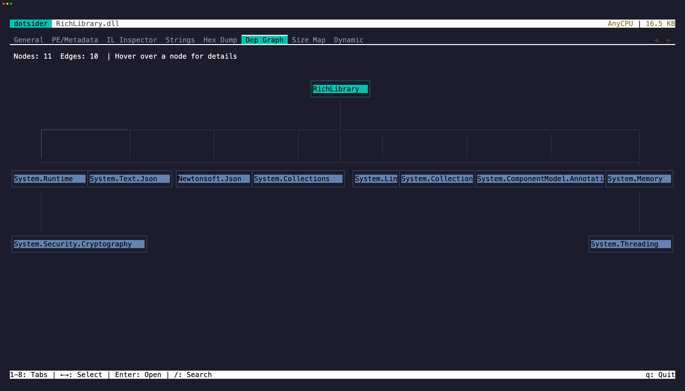

The **Dep Graph** tab (`6`) renders the full transitive closure of assembly references rooted at the analyzed assembly:

- Your assembly sits at the root at depth 0
- Every referenced assembly appears as a node, positioned by BFS depth
- Edge weights show how many TypeRefs in the referencing assembly resolve to the exact full identity of the target
- Framework assemblies (BCL, runtime pack) are included by default

Identity is keyed on the full `(name, version, culture, public key token)` tuple, so two assemblies that share a simple name but differ in any identity field appear as two distinct nodes. When a simple name collides, labels show only the identity fields that actually differ — for example `TargetLib v2.0.0.0` when only versions differ, or `TargetLib v1.0.0.0 (b77a5c56)` when only public key tokens differ.

## Unresolved and identity-mismatched nodes

References that cannot be located on disk or inside a bundle render as leaf nodes prefixed with `?`. When a probe produces a file whose simple name matches but whose manifest identity does not, the node renders with a `!` prefix and the graph does not expand from the mismatched file — the closure stays honest about what it actually contains.

## Scope and filter

Two independent controls narrow what you see. Both default to off so the full transitive closure is the starting view.

- `d`: toggle **scope**. `all` (default) shows every node in the closure; `direct` shows only the root and its direct references — depth 1 — plus the edges between them. `direct` is the .NET-native way to think about a project's own package dependencies without the transitive expansion.
- `f`: toggle **framework filtering**. Assemblies classified as part of the .NET framework (shared runtime, runtime pack, or well-known Microsoft public key tokens) are hidden along with any edges that touch them. Deployment-model-agnostic — framework assemblies shipped inside a self-contained publish or single-file bundle are classified consistently with framework assemblies loaded from the shared runtime.

The controls compose. `scope: direct` with framework filtering on shows the root plus only the non-framework direct references, which is typically the clearest view of what a project actually brings into its dependency graph. The root is always visible regardless of either control. The status line reports visible counts versus totals and which controls are active.

Transitive-only is intentionally not an option — hiding direct parents would produce disconnected islands and remove the explanation path that shows why deeper nodes are in the closure.

## Navigation

- `←` / `→`: move the keyboard selection across visible nodes. Selection auto-scrolls the viewport to keep the selected box in view.
- `↑` / `↓`: scroll the viewport up or down one row at a time.
- `PageUp` / `PageDown`: scroll by one viewport height.
- `Home` / `End`: jump to the top or bottom of the graph.
- `Enter`: open the selected node's resolved assembly in a new analysis context. Uses the resolution location recorded at traversal time, not a fresh probe from the root, so transitive nodes open correctly. Enter on the root is a no-op; Enter on an unresolved or identity-mismatched leaf surfaces an explanatory status message.
- `Esc`: return to the prior analysis context.
- `/`: search by name; `n` jumps to the next match and `N` (shift + n) jumps to the previous. Search always operates on the visible model, so hidden nodes (by scope or filter) are never matched or selected.

When the graph fits the viewport, depth bands spread through the available height. When it doesn't, bands pack tightly from the top and scroll reveals the rest.
