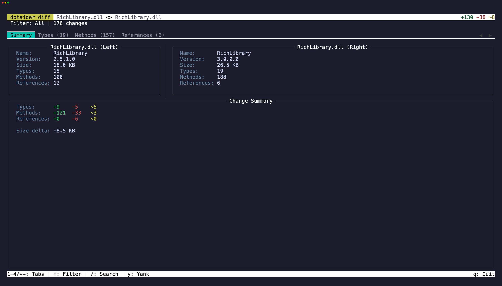

Diff mode compares two assemblies side by side:

```
dotsider diff v1.dll v2.dll
```

Each tab shows both assemblies with differences highlighted. Added items appear in green, removed in red, changed in yellow.

## Filters

Press `f` to cycle through diff filters:

| Filter | What it shows |
|--------|---------------|
| **All** | Everything from both assemblies |
| **Added** | Items only in the right assembly |
| **Removed** | Items only in the left assembly |
| **Changed** | Items present in both but different |

This is useful for reviewing breaking changes between library versions, auditing what changed in a new build, or understanding the impact of a refactoring.

## What gets compared

Types are matched by fully qualified name. Methods are matched by declaring type, name, and signature. Assembly references are matched by name.

For matched methods, the diff detects changes across several layers:

- **Attributes** — visibility, vtable layout, sealed/abstract flags
- **Implementation attributes** — IL vs native, managed vs unmanaged
- **Local variable signatures** — local types decoded and compared element-by-element
- **Exception regions** — try/catch structure, handler offsets, catch types resolved by name
- **IL instructions** — a normalized walk that resolves metadata token operands (method calls, field accesses, type references, string literals, standalone signatures) to their semantic names before comparing, so metadata table reordering between builds does not produce false positives

The Change column on the Methods tab shows which layers differ: `attributes`, `impl`, `body`, or a combination.

## Copy

The Summary tab has selectable info panels and change statistics. Press `Tab` to cycle focus between them, select text, and press `y` to copy. `iw` and `yiw` work in these panels for quick word-level copying. `V` selects the entire line and `yy` copies it.

On the Types, Methods, and References tabs, focus a row and press `y` to copy it as tab-separated values. A brief flash confirms the yank.

## Size diff (Native AOT)

Two mstat-backed inputs — bare `.mstat` size reports or Native AOT binaries with mstat
sidecars — open the **size-diff view** instead: AOT binaries carry no ECMA-335 metadata, so
the managed tabs would show empty tables. What matters for an AOT pair is where the bytes
went, and that is what renders.

```
dotsider diff before.mstat after.mstat
dotsider diff bin/v1/publish/app bin/v2/publish/app
dotsider diff before.mstat after.mstat --json   # headless document instead of the TUI
```

| Inputs | Opens |
|--------|-------|
| managed dll ↔ managed dll | the metadata diff above |
| mstat-backed ↔ mstat-backed | the size-diff view (Summary + Size Map) |
| AOT binaries without mstat sidecars | the metadata diff, with a hint to publish with `IlcGenerateMstatFile` |
| mstat-backed ↔ anything else | an error — the two sides would measure different things |

The **Size Map** tab is a delta treemap: **rectangle area is the absolute delta**, so the
largest regression is the largest rectangle and unchanged mass disappears entirely. Color
carries direction — and note it is deliberately the *inverse* of the managed tabs' colors,
because here **red means the binary got bigger**:

| Color | Meaning |
|-------|---------|
| bright red `+` | added — exists only in the new build |
| orange `Δ` | grown |
| soft green `Δ` | shrunk |
| bright green `−` | removed — exists only in the old build |

Direction is never carried by color alone: every rectangle leads with its kind glyph and a
signed delta (`+12.3 KB`). Aggregated entries — overload display collisions, frozen objects
grouped by owner — say so with an `(n entries)` suffix.

Keys: `Enter`/click drills into a subtree, `Esc`/right-click goes back up, `←`/`→` cycle
selection, `/` searches with `n`/`N`, and `f` cycles five direction filters (All, Added,
Removed, Grown, Shrunk). `w` opens the dependency chain that keeps the entry in the binary —
added entries answer from the new build's graph, removed entries from the old build's, and
pressing `w` again on a changed entry flips sides (the popup header names the side).
Namespace, type, assembly, and category tiles roll up the child DGML node names and show
representative root-first chains, so you do not have to drill to a method leaf just to ask
why a large subtree grew. Entries that truly have no DGML node, such as metadata blobs or
resources, say that directly. `d` on a method disassembles its native body, resolved by the
entry's mangled ILC node name — exact per overload and per instantiation. Repeated presses
cycle through every candidate body: an aggregate's symbols, and for a changed entry both
builds — new first, then baseline — so a grown method's before and after are one key apart.
The popup header names the side and which of how many is showing.

The **Summary** tab prints the same figures the headless `size-check` report does: totals on
every applicable basis, per-kind direction counts, and the top regressions and improvements.

For the CI side of this — budgets, exit codes, and pipeline wiring — see
[Size Regression](/usage/size-regression/).
