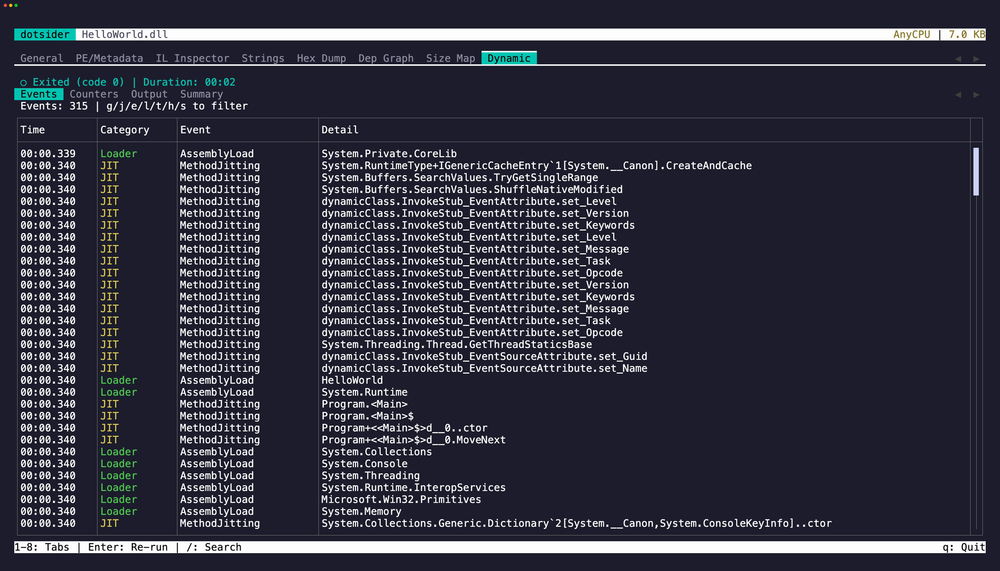

The **Dynamic** tab (`8`) launches the assembly and traces it in real time using EventPipe — the same diagnostic infrastructure behind `dotnet-trace` and `dotnet-counters`.

## What it captures

- **GC events** — collections, heap sizes, pause durations
- **JIT compilations** — every method as it gets compiled, with timing
- **Exceptions** — first-chance and unhandled exceptions
- **Performance counters** — CPU, memory, thread pool, GC rates
- **stdout / stderr** — captured output from the running process

## Sub-tabs

The dynamic tab has four sub-tabs. Press `Left` / `Right` to switch between them.

**Events** — a table of all trace events. Use the filter keys (`g` GC, `j` JIT, `e` Exception, `l` Loader, `t` Threading, `h` HTTP, `s` Socket) to narrow by category. Press `Esc` to clear the filter. Press `/` to search within events.

**Counters** — live performance counters in four sections: CPU, Memory, GC Collections, and Threading. Each section is a read-only editor — press `Tab` to cycle through them. Select text and press `y` to yank. `iw`, `yiw`, `V`, and `yy` all work. Counters update every ~1 second while the process is running.

**Output** — stdout and stderr from the traced process. stderr lines show in red. Press `/` to
search output. The latest 5,000 lines are retained. A line longer than 64 KiB is truncated and
marked so an unbounded write cannot exhaust the trace host.

**Summary** — trace summary stats (total events, duration, jitted methods, GC collections, exceptions, peak memory) in a read-only editor with the same selection and yank support as Counters. Below it, an event distribution chart shows the breakdown by category.

## Text selection and copy

On the Events and Output tables, focus a row and press `y` to copy it to the clipboard. The focused row flashes briefly to confirm the yank.

On the Counters and Summary editors, select text with click-drag or `Shift` + arrow keys, then press `y` to copy. `iw` selects the word under the cursor, `yiw` copies it directly. `V` selects the line, `yy` copies it. Press `Tab` to cycle focus between editors (on Counters) or between the editor and the sub-tab strip.

## Cross-tab navigation

Press `Enter` on a JIT compilation event to jump to that method's IL disassembly in tab 3's IL view.

## Re-running

Press `a` on the idle screen to open the argument editor. Enter validates the text and
launches the process. Escape discards the draft and restores the last committed arguments.
After the process exits, press Enter to re-run with the committed arguments.

Whitespace separates arguments. Single and double quotes group text, adjacent quoted and
unquoted segments form one argument, and `""` or `''` passes an empty argument. A
backslash escapes whitespace, the active quote, or another backslash. Unmatched quotes and
trailing escapes remain in the editor with a validation notice.

Shell operators such as `&`, `;`, `|`, `>`, `$()`, and `*` are literal argument content.
The launcher passes every value through `ProcessStartInfo.ArgumentList`.

## How it works

dotsider launches an existing managed DLL or platform executable with a reverse-connect diagnostic
port, so events are captured from the very first instruction. Windows direct-launch targets must
be `.exe` files; Unix targets must be executable. Shell scripts and Windows command files are not
accepted as Windows trace targets.

EventPipe parsing runs in the bundled framework-dependent `tracehost` helper and requires a .NET
10-or-later runtime. The helper uses the same absolute `dotnet` host that started it, and Unix
diagnostic sockets are isolated in a private temporary directory. If the helper or runtime is
unavailable, the Dynamic tab explains the missing requirement and leaves trace launch disabled.
