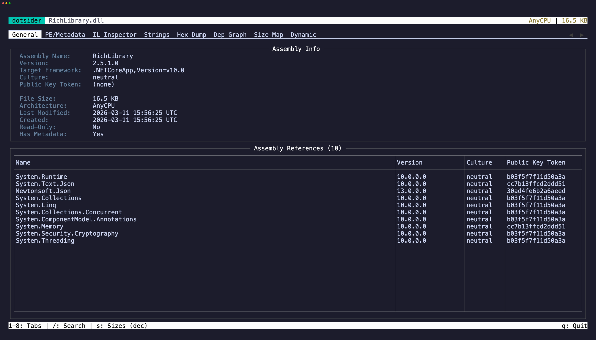

The **General** tab (`1`) is the first thing you see when opening an assembly. It shows:

- **Assembly identity** — name, version, culture, public key token
- **Target framework** — which .NET version the assembly targets
- **Architecture** — AnyCPU, x64, ARM64, etc.
- **PDB summary** — whether portable debug information came from a sidecar, an embedded PDB, or was unavailable
- **Dependency table** — all referenced assemblies with their versions

## Native AOT binaries

Opening a Native AOT executable adds a block below the standard fields. ILC strips ECMA-335 metadata, but every AOT image embeds a ReadyToRun header the runtime uses to find its module sections — dotsider validates that header and reports:

- **Binary kind** — `Native AOT (.NET)`
- **ILC / RTR format** — the ReadyToRun format version, section count, and header offset
- **Runtime version** — recovered from a version string the runtime pack embeds; shown as `(not detected)` when the layout doesn't match (a heuristic, never a guess)
- **Native imports** — module and function counts from the native import table (the full table lives in the PE/Metadata tab)
- **R2R sections** — how many ReadyToRun runtime sections the header describes (the table is in the PE/Metadata tab)
- **Recovered types** — type and method counts recovered from the embedded metadata (the list is in the PE/Metadata tab)
- **Frozen strings** — how many frozen string literals were recovered (the list is in the Strings tab)

## Text selection and copy

The Assembly Info panel is a read-only editor. Click into it or press `Tab` to move focus there, then select text with click-drag or `Shift` + arrow keys. Press `y` to yank the selection to the clipboard.

You can also use vim-style text objects: `iw` selects the word under the cursor, `iW` selects a whitespace-delimited WORD (handy for grabbing a version string or assembly name in one keystroke). `yiw` and `yiW` select and copy in one motion. `V` selects the entire line and `yy` copies it directly.

On the dependency table, focus a row and press `y` to copy it as tab-separated values. Press `Tab` to cycle focus between the info panel and the table.

## Drill into references

Select any row in the dependency table and press `Enter`. For .NET Core / .NET 5+ assemblies, dotsider searches the app directory, the .NET shared framework, and any single-file bundles in scope. For .NET Framework targets it walks the framework binder — `app.config` redirects, GAC, the framework runtime directory, configured `<codeBase>`, then the application base and `<probing privatePath>` — so drill-in lands on the same file the runtime would load. CLR 4 roots (net40 – net48) bind out of `Microsoft.NET\assembly\GAC_*` and the `v4.0.30319` runtime; CLR 2 roots (.NET Framework 2.0 / 3.0 / 3.5 SP1, detected from the `mscorlib` v2 reference) bind out of `%WINDIR%\assembly` and the `v2.0.50727` runtime. Press `Esc` to return.

This lets you walk an entire dependency chain without leaving the TUI — into framework assemblies like `System.Runtime` or `mscorlib`, into assemblies bundled inside a self-contained single-file executable, or into a redirected dependency whose loaded version differs from the version its metadata recorded.

For CLR 2 roots the assembly's `TargetFrameworkAttribute` is typically absent (the attribute didn't exist before .NET 4.0), so the General tab shows an inferred-runtime label rather than `(unknown)`, and the Dynamic tab correctly identifies the assembly as .NET Framework so EventPipe tracing isn't offered.
