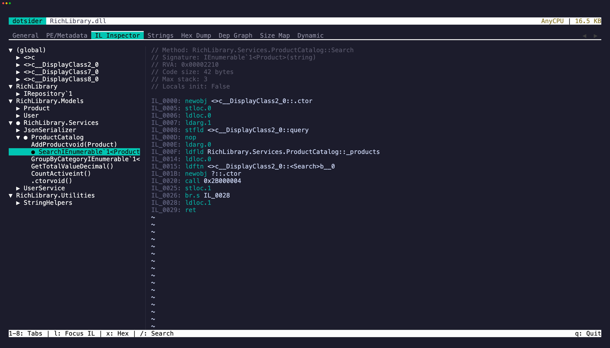

Tab `3` is the IL/native code view. Its label changes with the loaded image: **IL Inspector** for managed IL, **Disassembly** for native-only views, and **IL + Native** when managed IL is paired with native code. For ordinary managed assemblies, it shows a tree of all namespaces, types, and methods. Select a method to see its IL bytecode in the right pane.

Each instruction shows:

- **Offset** — byte offset within the method body
- **Opcode** — the IL instruction
- **Operand** — decoded metadata tokens, string literals, branch targets

When a portable PDB is available, the disassembly also shows PDB provenance, source spans, Source Link markers, and local variable names. Press `u` on a `[source link]` marker to copy the resolved URL. Embedded source documents can be opened from selected methods.

## Go to definition

Press `Enter` or `gd` while the cursor is on a token-bearing instruction (`call`, `callvirt`, `newobj`, `ldfld`, `castclass`, etc.) to navigate to the target. Navigable operands are underlined.

- **Local methods** open their disassembly directly.
- **External methods** resolve the referenced assembly and open it. Reference assemblies like `System.Runtime` that contain no IL are automatically mapped to their implementation (`System.Private.CoreLib`). Resolution probes the app directory, the .NET shared framework, and any single-file bundles in scope.
- **Fields** show the field signature, declaring type, and attributes in the right pane.
- **Generic instantiations** (`List<int>`, `Task<string>`) unwrap to the underlying open generic type.

Press `Esc` to go back. The previous IL bytecode, cursor position, tree expansion state, and scroll position are all restored. You can chain multiple jumps and unwind them one at a time.

## Cross-tab navigation

- Press `x` on a selected method to jump to its body in the **Hex Dump** tab. The hex view scrolls to the method's RVA.
- Press `o` on a selected method to open embedded source when the PDB carries it.
- Press `Esc` to return to where you came from.

## Copy

Select text in the disassembly pane with click-drag or `Shift` + arrow keys, then press `y` to yank it to the clipboard. The cursor collapses to the end of the selection and a brief flash confirms the copied range — matching neovim's yank behavior.

`iw` selects the word under the cursor (an opcode, a token, a label). `yiw` copies it directly. `iW` grabs the full whitespace-delimited token, which is useful for qualified names in operands. `V` selects the entire instruction line and `yy` copies it directly.

## Search

Press `/` to search method names or IL content. Matches are highlighted in both the tree and disassembly panes.

## Native mode (Native AOT)

Open a Native AOT binary and tab `3` is labeled **Disassembly** in native mode: the left tree lists the recovered **functions** bucketed namespace → type → function (managed-named functions parsed from the symbols), plus `(runtime)`, `(stubs)`, and `(functions)` buckets for the rest. Selecting a function disassembles it to real native code for x64, Arm64, x86, Arm32/Thumb-2, RISC-V64, LoongArch64, or Wasm32 on the right, with the same subtle syntax highlighting as the IL pane — address, mnemonic, registers, immediates, and the resolved target comment.

Call and branch targets are resolved to names: a direct call shows `call Foo`, a target landing inside a function shows `Foo+0x12`, an intra-function jump becomes a synthesized `loc_…` label, a RIP-relative load names the referenced data symbol, and an indirect call through the import table resolves to `MODULE!Function`. Where the debug sidecar carries line data, `// file:line` annotations mark the source.

`Enter` on a resolved call/branch jumps to that function (the target is underlined to signal it's navigable); `Esc` returns. `x` jumps to the function's bytes in the Hex Dump. The Size Map and the PE/Metadata **Symbols** sub-tab cross-navigate into the native listing.

## ReadyToRun images

A ReadyToRun (crossgen2) image keeps its full metadata, so tab `3` is labeled **IL + Native** and the tree stays in its managed namespace → type → method shape. A glyph marks each method: `✓` precompiled, `–` IL only (not in this image). Selecting a precompiled method splits the right pane — IL on the left, its native code ranges (hot, funclets, cold) on the right — with call targets resolved through the import tables (`call Console.WriteLine`, `call WriteBarrier`, a generic instantiation named with its type arguments). A composite `*.r2r.dll` shows its component assemblies in the tree and navigates across them; a component DLL disassembles from the owner composite it belongs to.

## Pre-ILC sidecar correlation (Native AOT)

Publishing a Native AOT binary leaves its pre-ILC inputs behind in the build tree — the managed assemblies ILC compiled (root plus local project references), their portable PDBs, and the `.mstat`/`.dgml` size and dependency sidecars. When you open an AOT binary, dotsider probes for them (following the `.ilc.rsp` response file first, then the `obj\<cfg>\<tfm>\<rid>` layout, then a sibling assembly) and, if it finds an attachable managed assembly, offers to attach it:

```
 Native AOT Sidecars Detected
 …
 Enter: Attach | Esc: No, native only
```

Press `Enter` to attach or `Esc` to stay native-only. When attached, the metadata tabs (PE/Metadata, Strings, General references) fill from the managed assembly while the binary tabs stay native, and tab `3` is labeled **IL + Native** so a method's IL and native code can show side by side.

- The tree shows correlation markers: `✓` correlated exactly, `~` shared with overloads (ambiguous), `±` size-only (mstat evidence but no native symbol), `–` not in the native image (trimmed or inlined).
- Selecting a correlated method splits the right pane: pre-ILC IL on the left, native disassembly on the right, with call targets named from the companion metadata. A status line reports the native address and size.
- Overloads that ILC's mangling collapses are reported as ambiguous with the shared size, never guessed apart. A generic method with several instantiations shows every native symbol.
- `t` toggles between the managed and native tree; the tab label switches between **IL + Native** and **Disassembly** with that mode. `l` cycles focus between the IL and native panes (and swaps the visible pane when the terminal is too narrow to split); `Tab` steps tree → IL → native. Search (`/`) follows the focused pane. `x` opens the Hex Dump at the correlated symbol's file offset.
- On the **General** tab, `a` re-opens the offer and `d` detaches; the tab also reports the correlation counts (`{exact} of {total} methods in native image`).

The same correlation is available headlessly:

- CLI: `dotsider analyze <binary>` prints the cheap probe summary without attaching; `dotsider analyze <binary> --correlate` prints the correlation counts; `--correlate Type.Method` or `--correlate 0x<address>` prints the method's IL beside its native code. An ambiguous name lists every candidate and exits non-zero.
- MCP: the `correlate_method` tool (and the `preIlc` summary on `get_assembly_info`) expose the same data over a session or a file path.
- Session socket: the `correlate-method` command answers the same query against a running instance.
