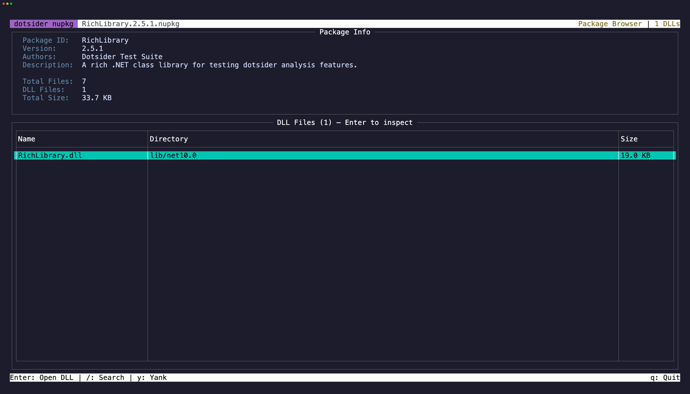

Open any `.nupkg` file directly:

```
dotsider package.nupkg
```

dotsider lists the package contents — the `.nuspec` manifest, lib folders per target framework, and any other files. Select a DLL and press `Enter` to open it in the full analyzer with all 8 tabs.

NuGet packages are ZIP files. dotsider extracts assemblies to a temp directory for analysis, so everything works exactly as it does with regular DLLs.

## Navigation

Press `Tab` to cycle focus between the Package Info panel and the DLL table. Press `Esc` to return from a DLL inspector back to the package browser. The previously selected DLL row is restored.

## Copy

Select text in the Package Info panel and press `y` to copy. On the DLL table, focus a row and press `y` to copy the file path.
