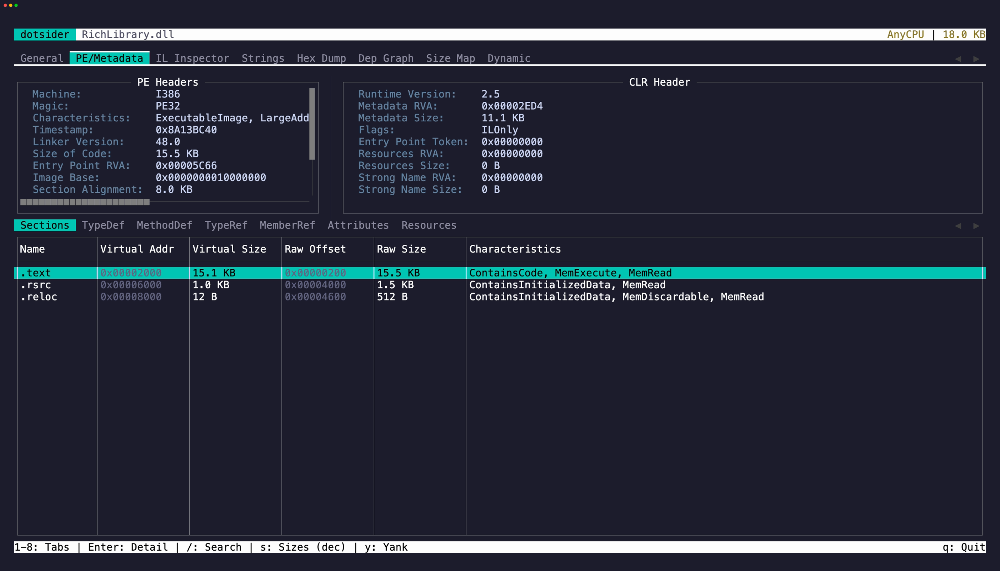

The **PE / Metadata** tab (`2`) exposes the raw structure of the Portable Executable:

- **COFF header** — machine type, number of sections, timestamp
- **CLR header** — runtime version, flags, entry point token
- **Sections** — .text, .rsrc, .reloc with virtual addresses and sizes
- **TypeDefs** — every type defined in the assembly
- **MethodDefs** — every method with its RVA and flags
- **AssemblyRefs** — referenced assembly metadata
- **Custom attributes** — applied attributes with decoded arguments
- **Resources** — embedded resources with names and sizes
- **Debug Directory** — CodeView, embedded portable PDB, checksum, and reproducible-build entries
- **Imports** — the native import table, one row per imported function with module, hint, and ordinal
- **Exports** — the native export table, including forwarders and ordinal-only exports
- **Load Config** — the load configuration directory: security cookie, SEH handler count, and decoded Control Flow Guard flags
- **R2R Sections** — the ReadyToRun section table of a Native AOT binary, each region's id, virtual address, size, and file offset
- **AOT Types** — types recovered from a Native AOT binary's embedded metadata; press Enter to see a type's methods
- **Symbols** — native symbols with addresses, sizes, and kinds, demangled to managed names where the binary's own metadata allows; press Enter for the mangled name, aliases, section, and source location

Imports and Exports need no CLR header, so they light up for native apphosts and Native AOT executables where the metadata tables are empty. They read whichever native format the binary uses: PE import descriptors on Windows, ELF needed libraries and versioned dynamic symbols on Linux, and Mach-O loaded dylibs and two-level-namespace bindings on macOS. Load Config is a PE-only structure and stays empty on ELF and Mach-O.

R2R Sections and AOT Types apply to Native AOT binaries. ILC strips ECMA-335 metadata, but every AOT image embeds a ReadyToRun header that locates its runtime regions, and the reflection and stack-trace metadata it keeps still names the binary's own types and methods — so a stripped binary describes itself. Both work on every platform where the data is file-backed.

Symbols reads whichever artifact the platform's publish produced — a native PDB on Windows, a `.dbg` ELF sidecar on Linux, or a dSYM bundle on macOS — after validating it against the binary's identity (PDB GUID and age, GNU build id / debuglink CRC, or Mach-O UUID; a mismatching file is rejected, never misread). ILC's mangled names are demangled by joining against the binary's own recovered metadata, so a managed name is marked exact only when the join is unambiguous. Functions carry their declaring source file and line when the symbol file records them. Without a symbol file, unwind data (`.pdata`, `.eh_frame`, or `LC_FUNCTION_STARTS`) still recovers nameless function boundaries — enough for counts and size histograms, though unwind data can miss leaf and thunk functions.

## Text selection and copy

The PE Headers and CLR Header panels are selectable editors. Press `Tab` to cycle focus between them and the metadata table. Select text and press `y` to copy. `iw` and `yiw` work here too — quick way to grab a single header value. `V` and `yy` work for line-level selection and copy.

Press `Enter` on any metadata table row to open a detail popup. The popup is also a selectable editor — select specific values and press `y` to yank them.

On table rows, press `y` to copy the focused row as tab-separated values.

## Jump to IL

Select a TypeDef or MethodDef and press `g` to jump directly to its IL disassembly in tab 3. The IL Inspector opens with that item pre-selected.
