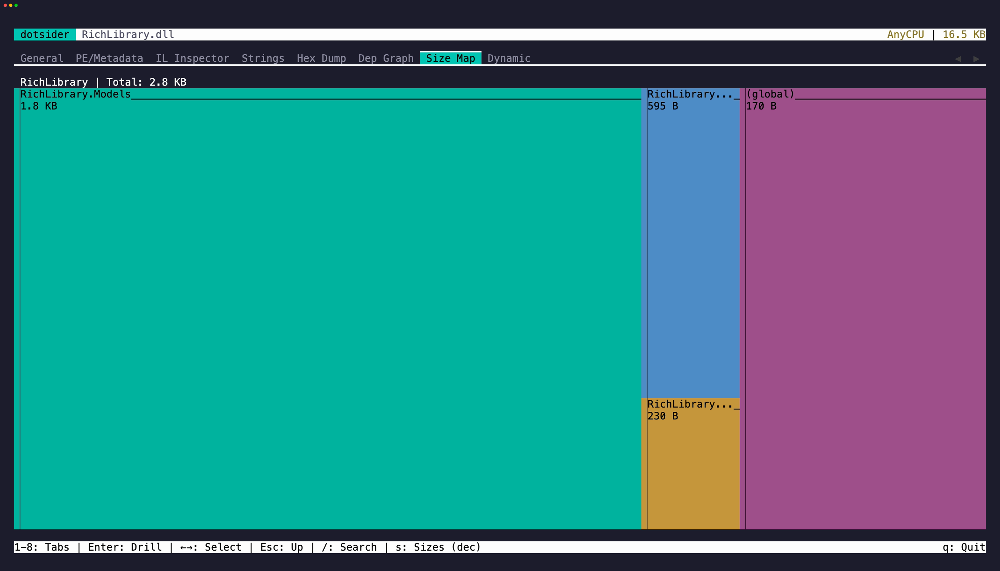

The **Size Map** tab (`7`) shows a treemap of IL code size:

- **Assembly** at the top level
- **Namespaces** as the first breakdown
- **Types** within each namespace
- **Methods** as leaf nodes, sized by IL byte count

## Drill in

Click or press `Enter` on any region to drill into it. When you reach a method leaf, pressing `Enter` jumps to its IL disassembly in tab 3.

This is useful for finding unexpectedly large methods or identifying which parts of your codebase contribute the most to assembly size.

## Native AOT binaries

For a Native AOT binary the treemap is built from the compiler's own size report instead of IL. Publish with two properties and copy the outputs next to the executable — ILC writes them to the native intermediate directory (`obj/.../native/`), not the publish folder:

```xml
<IlcGenerateMstatFile>true</IlcGenerateMstatFile>
<IlcGenerateDgmlFile>true</IlcGenerateDgmlFile>
```

With the `.mstat` beside the binary the tree shows every assembly ILC compiled in, drilling through namespaces and types to native method sizes (code plus GC and exception info). Each type carries an explicit `MethodTable` leaf for its runtime type structure, and category regions sit beside the assemblies: `Blobs` for global data like embedded metadata and dispatch maps, `Frozen Objects` for compile-time allocated objects (mostly string literals), `RVA Fields` for data mapped straight into the image, and `Resources` for embedded manifest resources.

With the `.codegen.dgml.xml` beside the binary too, press `w` on any method, type, or frozen object to see why it is in the binary: the chain of dependencies from a root down to the node, each step annotated with the compiler's reason. `Esc` dismisses the chain.

### Without an mstat

When no `.mstat` sits beside a Native AOT binary, the treemap is built from its native symbols instead — the PDB, `.dbg`, or dSYM the publish produced. Functions joined to managed names group under assembly > namespace > type, and the compiler-generated data nodes land in explicit categories (`MethodTables`, `Frozen Objects`, `Stubs`, `Generic Dictionaries`, `Statics`, `Data`), with unjoined names under `Runtime`. The mstat report always wins when present — it is the compiler's own accounting.

With no symbol file either, unwind data still yields nameless function boundaries under an `Unattributed` category — enough for a size histogram, though unwind data can miss leaf and thunk functions, so a boundary-only tree understates slightly.

## ReadyToRun images

For a ReadyToRun (crossgen2) image the treemap sizes the **precompiled native code** — each method's code ranges summed and grouped under assembly > namespace > type — rather than IL bytes, so the map reflects what crossgen2 actually emitted.
