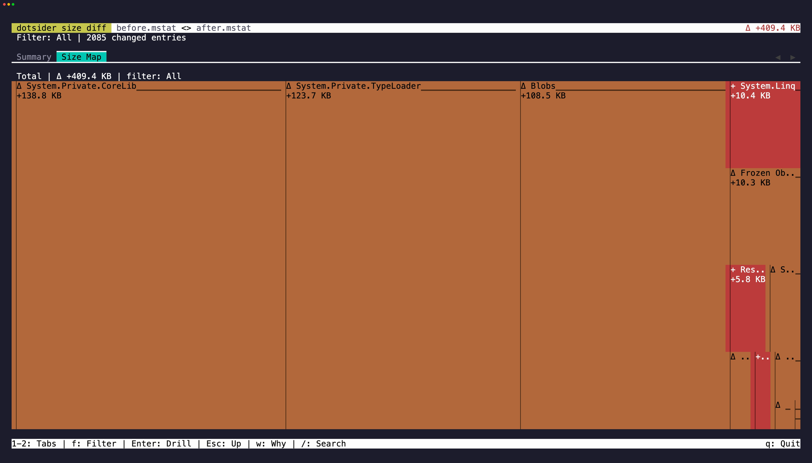

Native AOT binaries grow for reasons the source diff never shows: a new generic instantiation
drags in the type loader, a LINQ call materializes a family of enumerator types, a string
literal freezes into the image. dotsider turns that into a first-class workflow: **diff two
builds' ILC size reports so the regression reads as a treemap**, and **gate CI on size
budgets** with the top contributors printed when one breaks.

## Publishing the inputs

The size report is the `.mstat` file ILC emits when a project publishes with
`IlcGenerateMstatFile`; the dependency graph (`IlcGenerateDgmlFile`) additionally answers
*why* an entry is in the binary:

```xml
<PropertyGroup>
  <PublishAot>true</PublishAot>
  <IlcGenerateMstatFile>true</IlcGenerateMstatFile>
  <IlcGenerateDgmlFile>true</IlcGenerateDgmlFile>
</PropertyGroup>
```

ILC writes both to the native intermediate directory
(`obj/Release/<tfm>/<rid>/native/`). Copy them beside the published binary so dotsider's
sidecar discovery finds them:

```xml
<Target Name="CopyAotSidecarsToPublish" AfterTargets="Publish">
  <ItemGroup>
    <_AotSidecar Include="$(NativeIntermediateOutputPath)$(TargetName).mstat" />
    <_AotSidecar Include="$(NativeIntermediateOutputPath)$(TargetName).codegen.dgml.xml" />
  </ItemGroup>
  <Copy SourceFiles="@(_AotSidecar)" DestinationFolder="$(PublishDir)"
        Condition="Exists('%(_AotSidecar.Identity)')" SkipUnchangedFiles="true" />
</Target>
```

Every size command accepts either a bare `.mstat` file or an AOT binary with the sidecar
beside it.

## Interactive: the delta treemap

```
dotsider diff before.mstat after.mstat
dotsider diff bin/v1/publish/app bin/v2/publish/app
```

Two mstat-backed inputs open the size-diff TUI — Summary and Size Map tabs — instead of the
managed diff (AOT binaries carry no ECMA-335 metadata, so the managed tabs would be empty
tables). See [Diff Mode](/usage/diff-mode/) for the keys and the treemap encoding. Add
`--json` to skip the TUI and print the machine-readable size-diff document instead.

## Headless: `dotsider size-check`

The CI command. It measures a target, optionally compares it with a baseline, renders the
report in `text`, `json`, or `markdown`, evaluates size budgets, and exits non-zero when one
breaks:

```
dotsider size-check out/pr/app --budget max=25mb
dotsider size-check out/pr/app --baseline baseline/app.mstat --top 20
dotsider size-check out/pr/app --baseline baseline/app.mstat \
  --budget max=25mb --budget growth=1% --budget ns=System.Text.Json:growth=10kb
```

| Exit code | Meaning |
|-----------|---------|
| 0 | Report produced; every error-severity budget passed |
| 1 | Usage or input error (missing file, no mstat, invalid budget) |
| 2 | A budget with `error` severity was exceeded |

### Budget grammar

`[scope:]limit(,limit)*` — repeatable via `--budget`:

| Piece | Forms | Notes |
|-------|-------|-------|
| scope | `total` (default) · `ns=<Namespace>` · `asm=<Assembly>` | `ns=` covers sub-namespaces: `System.Text.Json` includes `System.Text.Json.Serialization`, never `System.Text.Json2` |
| limit | `max=SIZE` · `growth=SIZE` · `growth=PERCENT` | `max=` caps the current value; `growth=` caps the change versus `--baseline` |
| SIZE | `4096`, `4096b`, `10kb`, `25mb`, `1gb` | 1 kb = 1024 bytes; bare numbers are bytes |
| PERCENT | `1%`, `2.5%` | growth only; a brand-new scope (baseline 0) always breaches |

Examples: `max=25mb` · `growth=1%` · `total:max=25mb,growth=50kb` ·
`ns=System.Text.Json:growth=10kb` · `asm=MyApp:max=2mb`.

### Budget files

`--budget-file budgets.json` accepts spec strings and object entries in one document. The
object form is how a team names budgets, downgrades one to a warning (reported, never fails
the gate), or pins a per-budget contributor count:

```json
{
  "budgets": [
    "total:max=25mb",
    "total:growth=1%",
    {
      "name": "JSON serializer growth",
      "description": "System.Text.Json tends to bloat via new converters.",
      "scope": "ns=System.Text.Json",
      "growth": "10kb",
      "severity": "warning",
      "topN": 5
    }
  ]
}
```

### What the numbers measure

Every report states its **basis**. Binaries measure **file size on disk** (`fileSize`); a
bare `.mstat` anywhere in the pair measures **mstat attributable totals** (`mstatTotal`) on
both sides so the figures stay comparable — the two differ by headers, alignment, and bytes
the report does not attribute. Namespace and assembly budgets always measure mstat
aggregates: methods, MethodTables, RVA fields, and frozen objects attributed via their
*owning type* (the code that caused the bytes). Ownerless frozen objects — string literals —
land in an explicit `(unattributed)` bucket that scoped budgets never draw from but the
aggregates always show, so no byte is silently dropped.

### Why did this appear?

`--why` attaches the ILC dependency chain for the top added contributors (requires the
target's DGML sidecar): the root kept X, X kept Y, down to the new entry.

## Wiring it into CI

### GitHub Actions

Run the same job on pull requests and the target branch. The action keeps its own matching
successful branch baseline:

```yaml
- uses: actions/checkout@v6

- name: Publish NativeAOT application
  run: >-
    dotnet publish src/App/App.csproj -c Release -r linux-x64
    -p:PublishAot=true -p:IlcGenerateMstatFile=true -o out/current

- name: Size gate
  uses: willibrandon/dotsider@v0
  with:
    target: out/current/App
    budgets: |
      max=25mb
      growth=1%
```

The action selects the release for the runner's OS and architecture, verifies its SHA-256
sidecar, and caches the result. It writes the Markdown report to the job summary and uploads
the Markdown and schema-versioned JSON reports before enforcing a budget failure. Set
`dotsider-version` to an exact release for reproducibility, or set `dotsider-path` to an
existing executable for an offline or custom installation. Give the job `actions: read` and
`contents: read` permissions so it can find earlier successful artifacts.

On the first branch run, absolute limits are evaluated and growth limits are named as
deferred. If the job succeeds, Dotsider uploads the binary, resolved `.mstat`, optional DGML,
and a hashed manifest as the baseline. Later branch runs compare with their preceding
successful run; pull requests compare with the newest successful run of their target branch.
The artifact identity includes the workflow, job, logical target, and detected RID. Set
`baseline-key` only when the target lives under a randomized temporary path.

Supplying `baseline` remains an explicit override for release-to-release comparisons. It
disables automatic discovery and retention for that action invocation.

#### Manual and `/aot-size` reports

An on-demand report uses artifacts emitted by the normal build; it does not check out or run
pull-request code in the comment workflow. Add this to the normal PR and branch build after
publishing:

```yaml
- name: Upload NativeAOT size input
  uses: actions/upload-artifact@v7.0.1
  with:
    name: nativeaot-size-linux-x64
    path: |
      out/current/App
      out/current/App.mstat
      out/current/App.codegen.dgml.xml
    if-no-files-found: error
```

Then copy the [`workflow_dispatch` and `/aot-size` template](https://github.com/willibrandon/dotsider/blob/main/integrations/size-check/examples/github-aot-size.yml).
It accepts `/aot-size` in the pull-request conversation or a review comment, verifies that
the author has write access, resolves the PR through GitHub's API,
downloads the successful PR and base-branch input artifacts, runs Dotsider, and updates a
single PR comment. Change the template's build workflow, artifact name, target path, and
budgets to match the project.

### Azure DevOps

Run the task after the NativeAOT publish on both pull requests and the target branch:

```yaml
- checkout: self

- pwsh: >-
    dotnet publish src/App/App.csproj -c Release -r linux-x64
    -p:PublishAot=true -p:IlcGenerateMstatFile=true
    -o $(Build.ArtifactStagingDirectory)/current
  displayName: Publish NativeAOT application

- task: DotsiderSizeCheck@1
  inputs:
    target: '$(Build.ArtifactStagingDirectory)/current/App'
    budgets: |
      max=25mb
      growth=1%
```

Install the public **Dotsider** extension from the Azure DevOps Marketplace. The task uses
Node 24 on current agents and retains a Node 20 handler for older supported agents. Its tool
selection, checksum verification, reports, summary, exit meanings, baseline lifecycle, and
typed outputs match the GitHub Action. It uses the pipeline's short-lived OAuth token to read
successful builds and artifacts from the same pipeline definition, then removes that token
before Dotsider runs. A missing artifact is a first run; authentication, network, and corrupt
artifact failures remain errors. Set `baseline` only for an explicit override.

See [CI integrations](/reference/ci-integrations/) for every input and output, platform
compatibility, report lifetime, and release policy.

### Direct CLI

The marketplaces are optional. An installed Dotsider executable can drive the same gate:

```bash
dotsider size-check out/pr/App \
  --baseline baseline/App.mstat \
  --budget total:growth=1% \
  --budget ns=MyApp.Generated:growth=0 \
  --format json --output artifacts/dotsider-size-check.json \
  --summary-file artifacts/dotsider-size-check.md
```

Run report-upload steps with the platform's always condition if the CLI exits 2.

## From an agent

The MCP server exposes the same comparison as [`diff_size` and
`check_size_budgets`](/reference/mcp/), including inline budget JSON with the object form —
so an agent can ask "does this build pass the team's budgets" and get the structured report
back.
