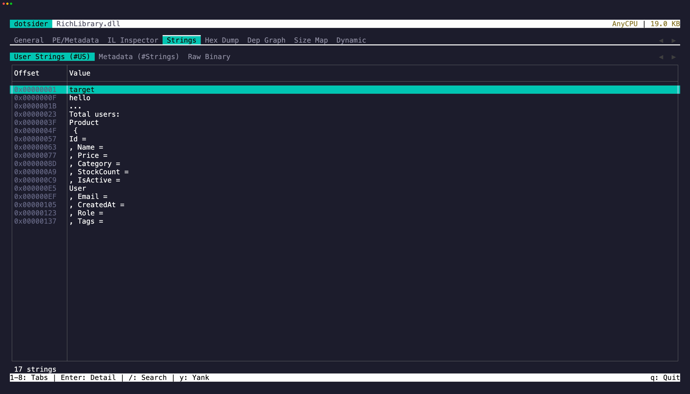

The **Strings** tab (`4`) extracts text from four sources:

- **User strings** — string literals from the `#US` metadata heap (the strings your code uses directly)
- **Metadata strings** — type names, method names, namespace names from the `#Strings` heap
- **Raw scan** — ASCII string extraction from the entire file, similar to the Unix `strings` command
- **Raw (UTF-16)** — UTF-16 string extraction from the entire file; managed string literals freeze as UTF-16 in Native AOT images, so this sub-tab is where an AOT binary's string constants appear

## Copy strings

Press `y` on a focused table row to copy the string value to the clipboard. Press `Enter` to open a detail popup where you can select and copy specific portions of longer strings. In the detail popup, `iw` and `yiw` let you grab individual words without reaching for the mouse. `V` and `yy` work for full-line selection and copy.

## Minimum length

Use the `--min-len` / `-n` flag to control the minimum length for both raw scans:

```
dotsider MyApp.dll -n 8
```

The default minimum is 4 characters. Increase it to reduce noise in large assemblies. Inside the TUI, `+` and `-` adjust it live on either raw sub-tab.
